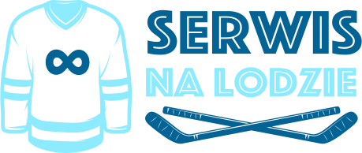

# PJATK PRACA DYPLOMOWA - FRONTEND

## 1.48

- (!) naprawiony bug z usuwaniem akcji meczowych
- (!) refresh widoków po usunięciu akcji meczowej
- (+) nowy widok ***TeamMatches***
- (+) nowy widok ***TeamMatch***
- (+) nowy widok ***MatchByTeamView***
- (!) edycja widoku ***SinglePlayer*** - poprawny powrót do widoku zespołu
- (+) obsługa meczów w wyszukiwarce - gość może wyszukać zakończone mecze, sekretarz i administrator widzą wszystkie mecze
- (+) obsługa statusów, wyświetlanie meczy według statusu
- (!) naprawione bugi związane z dodawaniem składu w widoku meczu
## 1.47

- (+) widok ***CreateNewMatch*** obsługuje teraz edytowanie info meczowego
- (+) dodanie akcji meczowych - tabelka
- (+) praca nad modułem najbliższy mecz

## 1.46

- (+) widok ***kontakt***
- (+) obsłużenie dodawania meczu po update backendu
- (+) obsłużenie logowania
- (+) z widoku zawodnika można przejść z powrotem do widoku zespołu
- (+) wyświetlanie widoków per rola - częściowo
- (+) dodany widok ***SingleLeagueView***
- (!) edycja widoku ***SingleTeamView***
- (!) edycja widoku ***TeamView*** dodany routing dla ligi
- (+) zaawansowany routing warunkowy pomiędzy ligą, a zespołami - podajemy id drużyny oraz id ligi
- (!) edycja widoku ***LeaguesListView*** - podzielenie widoku na 2 części: dla administratora oraz dla gości

## 1.45

- (+) dodanie kar w akcjach meczowych

## 1.44

- (+) dodany wynik do widoku meczu

## 1.43

- (+) dodane akcje meczowe - obsługa zapytań frontend/backend
- (+) praca nad listą akcji

## 1.42

- (+) widok Akcje meczowe, protokół oraz zakończ mecz w widoku SingleMatch panel administratora
- (+) można wysłać poprawnie zapytanie o nowy mecz w panelu administratora (poprawiona data)

## 1.41

- (+) widok ,,Składy'' w widoku pojedynczy mecz

## 1.40

- (+) Dodano widoki: Lista meczów, mecz, tworzenie nowego meczu, lista lig, dodawanie lig w panelu administratora
- (+) skrypt dataConvert, który konwertuje datę w stylu `1 września 1999 roku`

## 1.39

- (!) naprawiono widok ćwiczenia - po usunięciu lista strategii jest zaktualizowana poprawnie
- (+) dodanie numeru zawodnika do piątek
- (+) dodanie wyboru meczu w składzie (na sztywno!)
- (!) naprawiono bug związany z dodawaniem piątek w przypadku, gdy wybierzemy 4 piątki

## 1.38

- (!) poprawiono widok zawodników - dodawanie zawodników znajduje się w widoku "Zawodnicy", poprawne wyświetlanie
  miejsca urodzenia, gdy edytujemy zawodnika
- (!) poprawiono widok artykułów - dodawanie artykułów znajduje się w widoku "Artykuły"
- (!) poprawiono widok zespołów - dodawanie zespołów znajduje się w widoku "Zespoły"
- (!) refactoring
- (!) zmieniono widok DeveloperPanel
- (+) css dla komponentów uikit tab

## 1.37

- (+) użytkownicy - dodawanie i lista użytkowników

## 1.36

- (+) piątki - zawodnicy są usuwani z listy po wybraniu

## 1.35

- (+) widok strategii

## 1.34

- (!) praca nad strategiami

## 1.33

- (+) plan treningowy w panelu trenera
- (+) nowa biblioteka - vue signature
- (+) dodanie rzeczywistych drużyn do formularza zawodnika
- (+) praca nad strategiami w panelu trenera

## 1.32

- (+) obsługa błędów - piątki - brak możliwości dodania piątki z zawodnikiem który już istnieje w składzie

## 1.31

- (+) obsługa piątek - dodawanie składu

## 1.30

- (+) widok dodawania składu w panelu trenera

## 1.29

- (+) dodawanie/usuwanie sponsorów - administrator
- (!) styl dla listy sponsorów - ustalenie jednej szerokośći

## 1.28

- (+) docker
- (+) komponent **TrainerPanelComponent**
- (!) poprawione style dla navbar mobile
- (!) poprawiony button wyszukiwarki na mobile

## 1.27

- (+) widok **TeamAdminView**
- (+) widok **TeamListAdmin**
- (+) komponent **EditTeam**
- (+) komponent **TeamForm**
- (+) dodawanie/edytowanie/usuwanie zespołów

## 1.26

- (+) widok **TeamForm**

## 1.25

- (+) widok zespołów
- (+) widok pojedynczego zespołu
- (!) refactoring

## 1.24

- (+) dodanie drużyn do wyszukiwarki

## 1.23

- (+) edytowanie zawodników
- (+) usuwanie zawodników
- (+) edytowanie aktualności
- (+) usuwanie aktualności
- (!) refaktoryzacja kodu

## 1.22

- (!) refaktoryzacja kodu
- (+) moduł "najbliższy" mecz
- (+) submenu dla pozycji Aktualności

## 1.21

- (!) quickfix dla type errorów, gdy backend jest wyłączony
- (+) obsługa zdjęcia zawodników
- (+) dodanie klasy dla widoku dodawania aktualności

## 1.20

- (+) widok **NavbarMobileView**
- (+) wyszukiwarka zamyka się po przejściu do wybranego kontekstu
- (!) zmienione pozycje ikon w panelu administratora
- (!) refaktoryzacja kodu

## 1.19

- (+) widok sponsorów **SponsorsList** oraz **Sponsor**

## 1.18

- (+) widok **SinglePlayer**
- (+) wyszukiwanie zawodników oraz aktualności

## 1.17

- (+) wyszukiwarka działająca na aktualnościach
- (+) obsługa błędów z backenda na formularzu nowego zawodnika
- (+) stylowanie przycisku w widoku **PlayerFormView**

## 1.16

- (+) paginacja dla artykułów (widoku **News**)
- (+) widok **PlayersList**
- (+) hover dla mikrowidoku **ImageInputLarge**
- (+) komponent **ArticleForm**

## 1.15

- (+) dodany hover dla mikrowidoku **ImageInput**

## 1.14

- (!) refaktoryzacja kodu
- (+) widok **SingleArticle**
- (+) dodane ikony
- (+) widok **ArticleForm**

## 1.13

- (+) dodany widok **SearchView**
- (!) refaktoryzacja kodu

## 1.12

- (?) praca nad wyszukiwarką
- (+) dodanie widoku zawodników do panela developera (tymczasowo)
- (!) refaktoryzacja kodu

## 1.11

- (+) dodanie widoku **News**
- (+) dodanie widoku **Article**
- (+) dodanie komponentu **Logout**
- (+) dodanie animacji dla widoków
- (!) refaktoryzacja kodu
- (+) dodanie przykładowych aktualności
- (+) dodanie panelu developera
- (!) zmiana w szablonie - wylogowywanie po prawej stronie

## 1.10

- (+) dodanie mikrowidoku **ImageInputView**

## 1.09

- (+) nowe mikrowidoki: **UserNameView** oraz **UserPasswordView**
- (+) styl less dla komponentu **LoginForm**
- (+) styl less dla notyfikacji
- (+) komponent **LoginForm**
- (+) przykładowy widok logowania **LoginFormView** (zdjęcie z unsplash)
- zainstalowanie biblioteki **Vuex**
- aktualizacja mikrowidoków - dodanie notyfikacji
- aktualizacja v-model dla widoku **PlayerFormView**
- (+) komponent **LoginForm**
- (+) komponent **LoginFormView**

## 1.08

- Stworzenie **logo** na podstawie freepik.com (Konto premium) - edycja w Adobe Illustrator



- (+) widok **NavbarComponentView**
- (+) komponent **NavbarComponent**
- refaktoryzacja kodu
- UX design
- UIkit, zainstalowanie poprawnej dependencji UIkit (wcześniej używany vuikit)
- stworzenie favicon - generowanie na stronie https://favicon.io/favicon-generator/, następnie edycja w programie Gimp

## 1.07

- (+) dodanie listy zawodników (nawigacja -> Start) - komunikacja z backendem
- wstępne podzielenie widoku **PlayerFormView**

## 1.06

- (+) dodane loga dla mikrowidoku **TeamId**
- refaktoryzacja kodu
- CSS dla widoku **TeamId**

## 1.05

- (+) dodanie przykładowego zapytania do API serwera poprzez komponent **PlayersComponent**
- (+) dodanie biblioteki **axios**

## 1.04

- (+) dodanie temp data dla widoku **PlayerFormView** (Przykładowe drużyny, trzymanie kija oraz pozycje)
- użycie komponentu vue-multiselect dla mikrowidoków widoku **PlayerFormView**

## 1.03

- (+) dodanie biblioteki **vue-multiselect**
- (+) dodanie opcji pozycji dla zawodnika
- stylowanie opcji pozycji zawodnika

## 1.02

- usunięte niepotrzebne tagi css wewnątrz mikrowidoków
- (+) dodanie modeli do widoku **PlayerFormView**
- nadanie id dla mikrowidoków widoku **PlayerFormView**

## 1.01

### Zmiana podejścia do **mikrowidoków**

#### Niech nie będą zależne tylko od zawodnika (Segregacja)

## 1.0

### Dodany widok oraz mikrowidoki dla zawodnika

- dodany **Uikit**

## Project setup

```
npm install
```

### Compiles and hot-reloads for development

```
npm run serve
```

### Compiles and minifies for production

```
npm run build
```

### Run your unit tests

```
npm run test:unit
```

### Lints and fixes files

```
npm run lint
```

### Customize configuration

See [Configuration Reference](https://cli.vuejs.org/config/).
